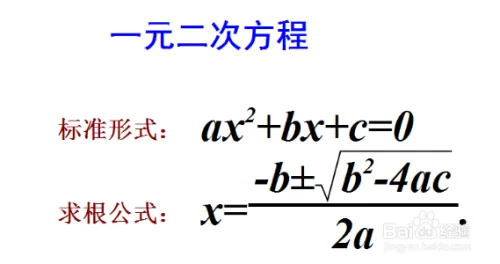
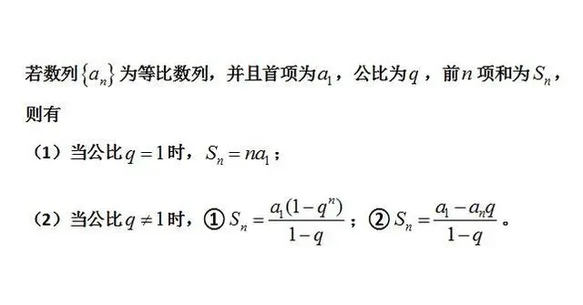

# 数字计算

### 根号计算

2 = 1.4141356
3 = 1.7320508
5 = 2.2360679

------

### 二元一次方程

#### 公式法

1. 无实根

先判断△=b²-4ac，若△<0原方程无实根；

2. 一个解

若△=0， 原方程有两个相同的解为： X=-b/（2a）

3. 两个解

参考求根公式

#### 因式分解

将一元二次方程aX²+bX+c=0化为如（mX-n）（dX-e）=0的形式可以直接求得解为X=n/m，或X=e/d。

常见因式分解公式

a^2 - b^2 = (a+b)(a-b)

a^2 ±2ab + b^2 =(a±b)^2

x^2 + (a+b)x + ab = (x+a) (x+b)

-----

### 等差数列

求和
sum = （（首项 + 末项）X 项数 ）/ 2

------

### 等比数列

----

### 向量

某城市朝阳区有两条立体交叉主干道，卫星观测到其延伸方向分别用，两个向量a（1，1，1），b（1，-1，2）表示，其要想在这两条立体交叉主干道之间修一条斜拉支柱，使得该支柱与这两条主干道同时垂直，可以表示该支柱延伸方向的是：

斜拉支柱的向量应与向量和同时垂直，依次代入选项验证：

A项：斜拉支柱向量为（1，1，-1），和向量的内积1×1+1×1+（-1）×1≠0，排除；

B项：斜拉支柱向量为（-3，1，2），和向量的内积（-3）×1+1×1+2×1=0，和向量的内积（-3）×1+1×（-1）+2×2=0，符合题干要求，当选。

故正确答案为B。

注释：当两个向量和垂直时，两个向量的内积为0， x1x2+y1y2+z1z2 = 0。