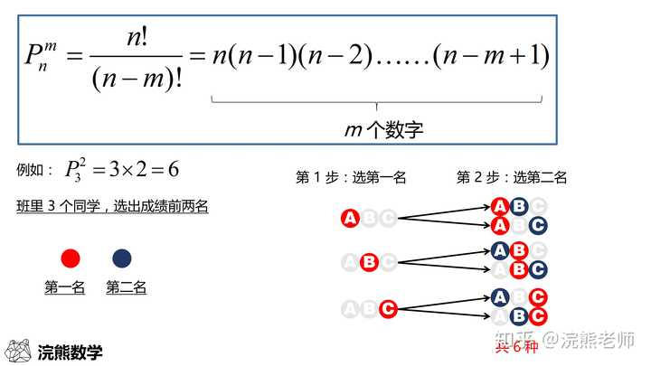
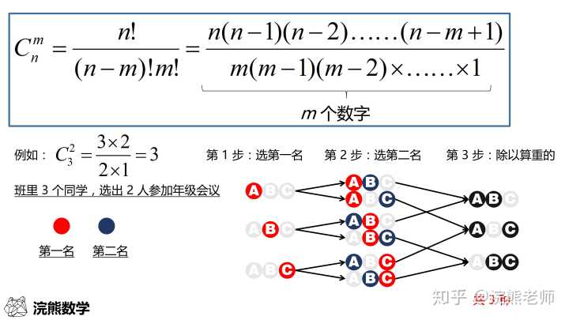
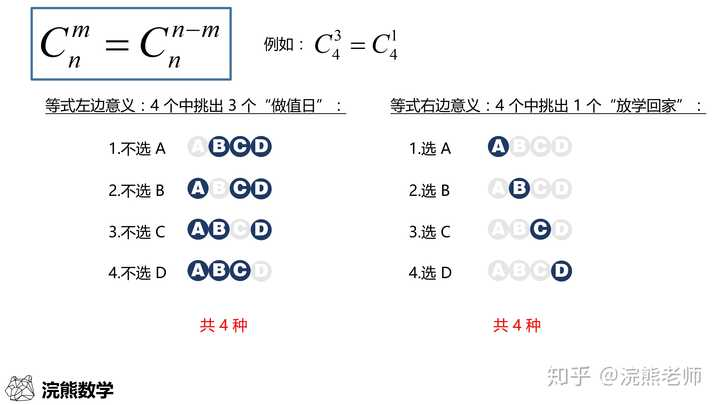
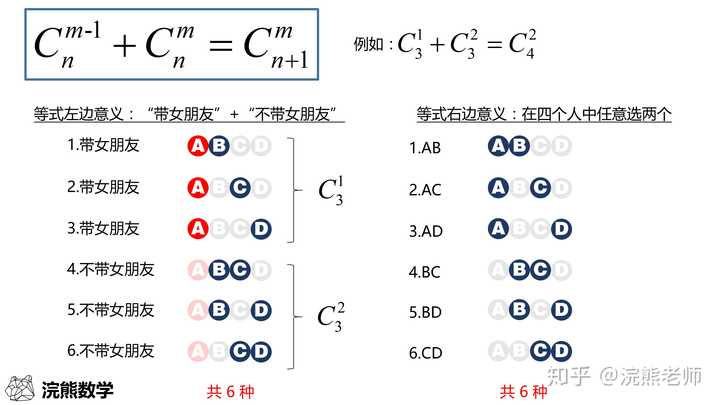
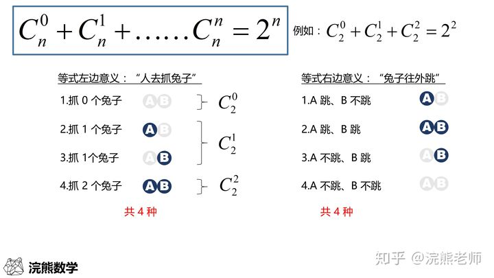
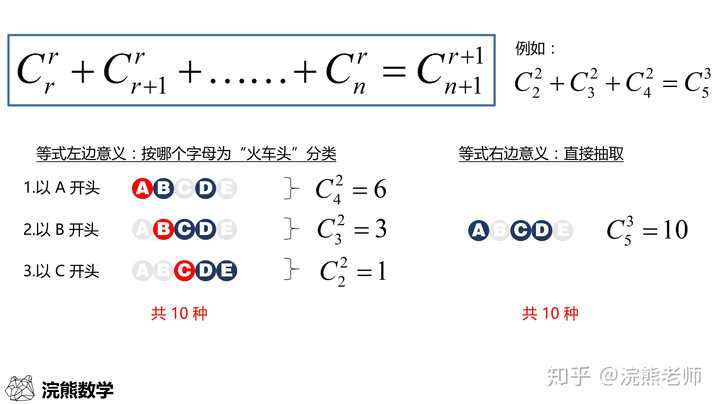
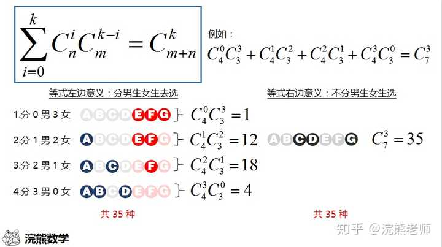

## 排列
排列的英文是 Permutation 或者 Arrangement，因此在数学符号中，用 P 或者 A 表示都可以，二者意思完全一样。

我们常见的 P 右边会跟两个数字（或字母），右下角的数字 n 表示总数，右上角的数字 m 表示抽出的个数。整个符号的意思是“从 n 个人中，有顺序地抽出 m 个人的抽法数”，可以读作“P n 抽 m”。

----

## 组合
组合的英文是 Combination，因此在数学符号中用 C 表示

C 右边会跟两个数字（或字母），右下角的数字 n 表示总数，右上角的数字 m 表示抽出的个数。整个符号的意思是“从 n 个人中，不计顺序地抽出 m 个人的抽法数”，可以读作“C n 抽 m”

### 公式一：个数反转

### 公式二：组合数相加

总数一致，上面的数字取大的，底下的数字加一

### 公式三：抓兔子和随机取出

取出个数不固定，0到n个之间

### 公式四：火车头

比如说你要在 A、B、C、D、E 这 5 个小球中抽取 3 个小球，咱们可以按“哪个小球是第一个”分类

### 公式五：男女选取组合

班里选几名学生，分男女选和不分男女选情况数一样。

## 特殊方法

### 插空法（处理不相邻问题）

把1，2，3，4，5组成没有重复数字且数字 1，2不相邻的五位数，则所有不同排法有多少种？
因为可先将 3，4，5三个元素排定，共有A（3，3）种排法，然后再将 1，2插入四个空位共有A（4，2）种排法，故由乘法原理得，所有不同的五位数有A(3,3)*A(4,2)=72种。

[空, (3,4,5), 空, (3,4,5), 空, (3,4,5), 空]

### 捆绑法（处理相邻问题）

6个不同的球放到5个不同的盒子中，要求每个盒子至少放一个球，一共有多少种方法?
则其中一个盒子必须得放 2 个，其他每个盒子放 1 个球，
所以从 6 个球中挑出 2 个球看成一个整体，则有C（6，2），这个整体和剩下 4 个球放入 5 个盒子里，则有A（5，5）。方案数：C（6，2）*A（5，5）=1800。

### 隔板法（处理相同元素+不同分组每组至少存在S个）

例1: n个**相同元素**，不同个m组，每组至少有**一个元素**；则只需在 n 个元素的n-1 个间隙中放置 m-1 块隔板把它隔成 m 份，求共有多少种不同方法？

元素共有N个，则间隙一共有N-1个，即从N-1个间隙插入M-1个隔板的组合方式，C(M-1, N-1)
[A | A | A | A | A ]

例2: 现在有10个球，要放进3个盒子里，并允许空盒子。

等价于13个小球按隔板法分组后，每个组都抽走一个小球
●|●|●●●●●●●●●●● -> ||●●●●●●●●●●
即C(M-1, N+K-1)

例3: 现在有10个球，要放进3个盒子里，每个盒子至少2个小球。

等价于7个小球按隔板法分组后，每个组都加入一个小球
●|●|●●●●● -> ●●|●●|●●●●●●
即C(M-1, N-K-1)

### 错位排列

例1：4个车位停放4辆不同的车，现重新排列，要求不准停在原来车位上

D1 = 0, D2 = 1, D3 = 2, D4 = 9, D5 =44 ,DN = (DN-1 + DN-2)N-1

### 环形排列

例1：5个人坐在圆桌旁，有几种排列

A(4,4) = 24 即 A(N-1, N-1)

### 重复剔除

例1： 9名运动员平均分成3组，有多少种排列方式？

C(3,9) * C(3,6) / A(3,3)；先获取第一组的所有组合方式C(3,9)，再获取第二组的所有组合方式C(3,6)，最后去除重复的结果A(3,3)（因为不同组之间没有顺序关系）

