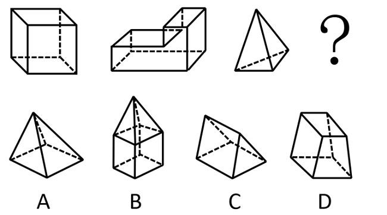
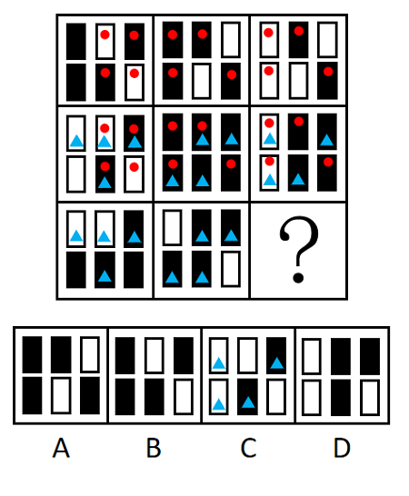
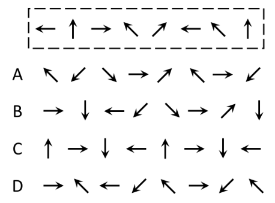
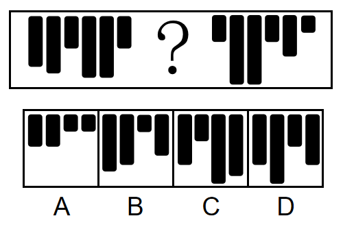
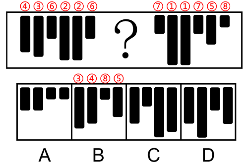
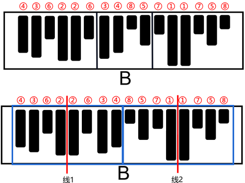
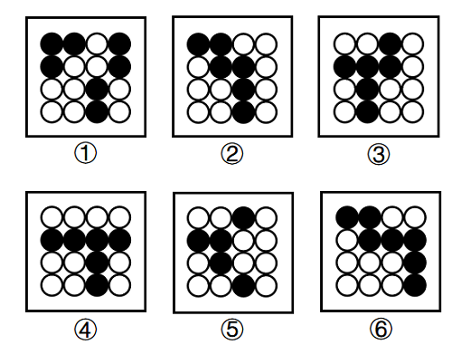

# title

## 例题

### 面个数的奇偶性

图1至图3的面数量分别为6、8、4，均为偶数，故？处图形面数量也应为偶数

### 局部相似

纵向观察，每一列都有4个相同图案和2个不同图案

### 元素种类

示例有8个元素，种类为5，
且位置1、6的小元素相同；位置2、8的小元素相同；位置4、7的小元素相同；位置3、5的小元素与其他位置均不相同，只有A项符合规律

### 出现次数的相同

1. 元素组成不同，且无明显属性规律，考虑数量规律。观察发现，题干图形由多个高低不一的黑色长条组成，且每种长度的黑色长条都出现了两次。
将黑色长条从高到低进行标号，如下图所示，“？”处的黑色长条应该分别与③④⑤⑧号黑色长条的长度相等。只有B项符合。

2. 在两个黑色长条②中间画一条线，左右呈现对称性；在两个黑色长条①中间画一条线，
左右也呈现对称性，故“？”填入黑色长条后，应使左边8块黑色长条和右边8块黑色长条的左右两边分别呈现对称性，具体如下图：

### 分割区域

图①②⑥白圆部分均为两部分，图③④⑤白圆部分均为三部分

